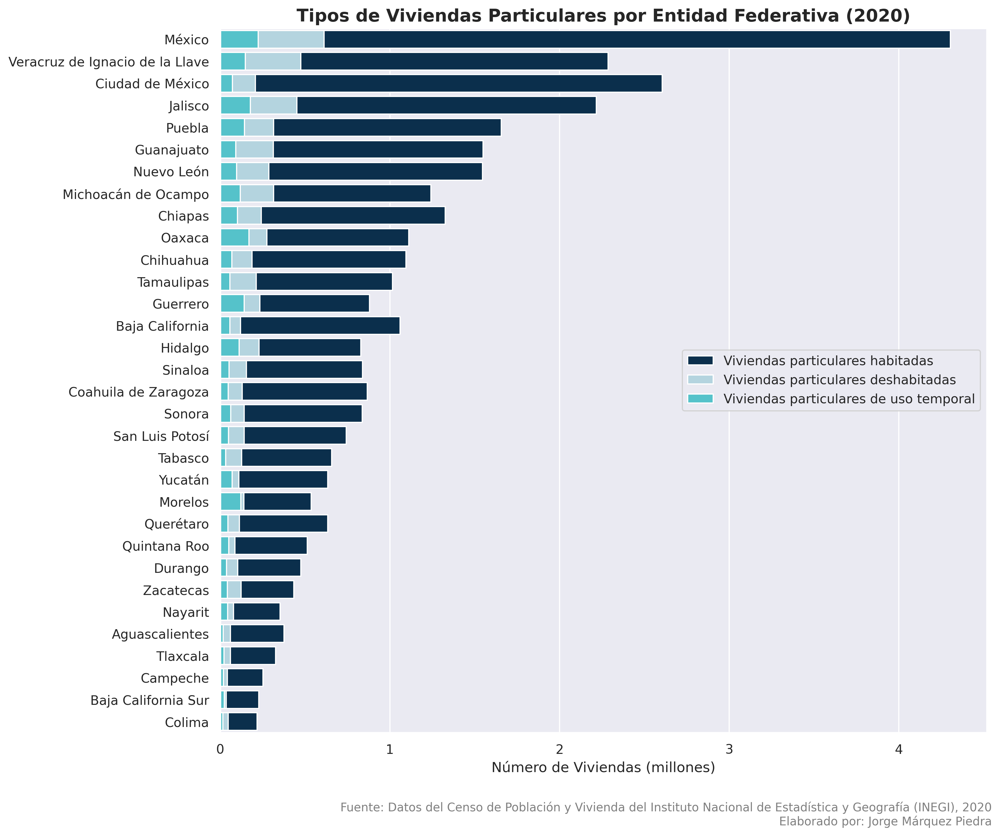
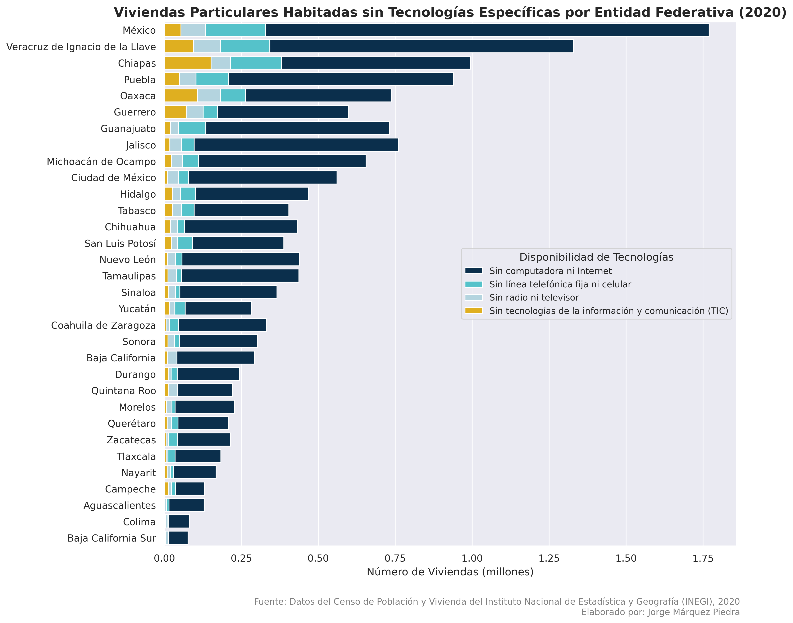
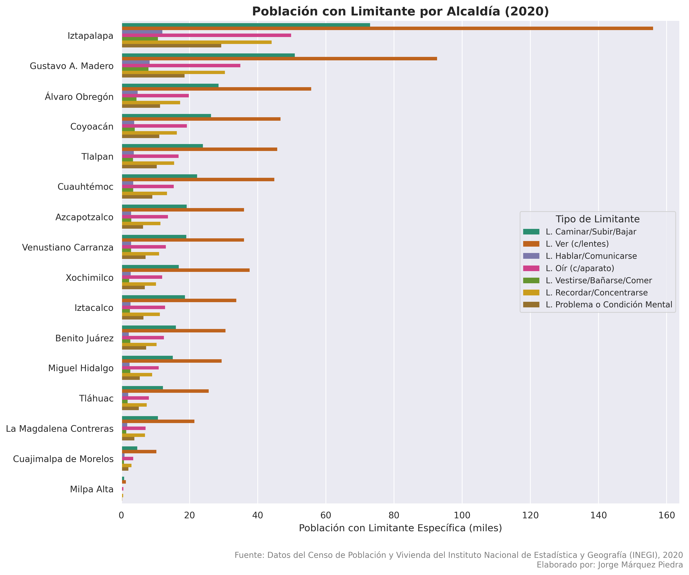
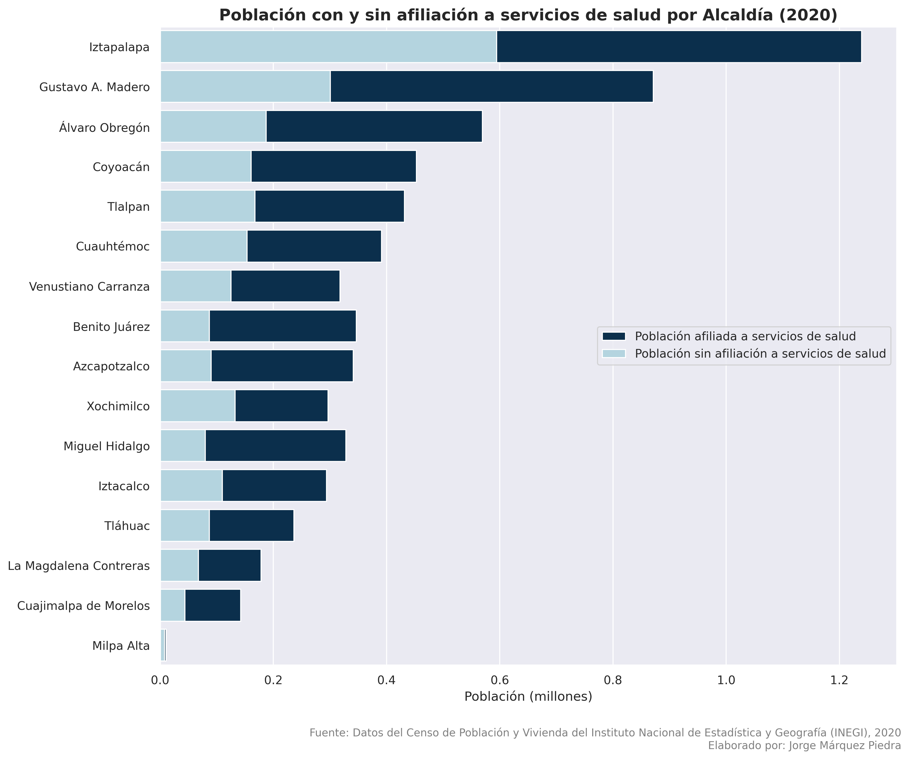
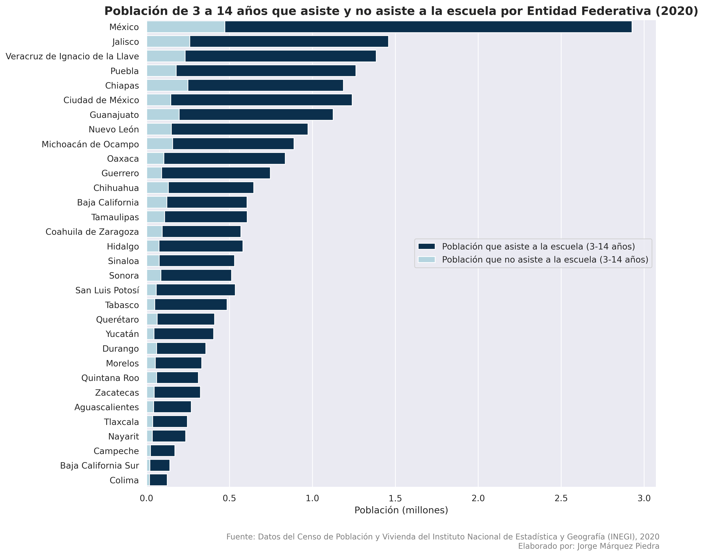
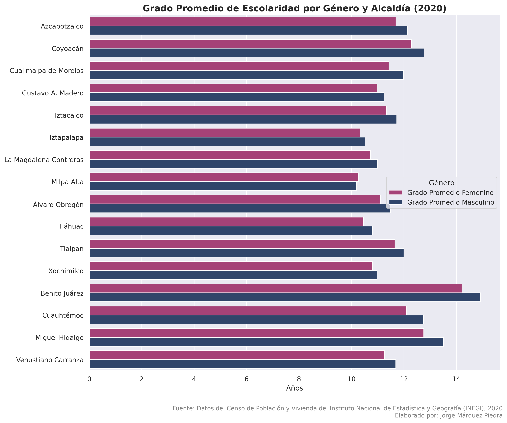
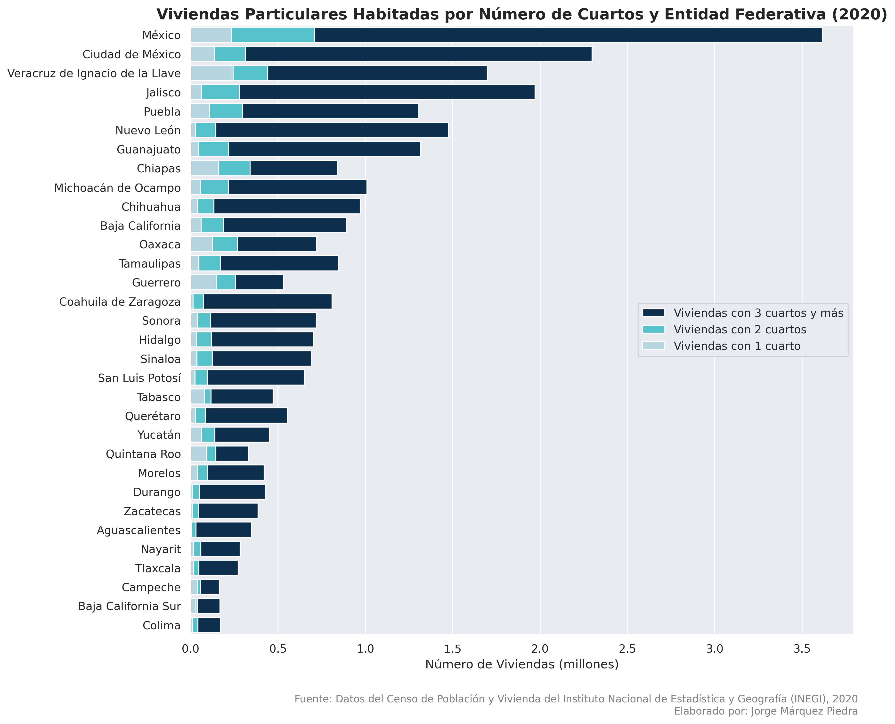
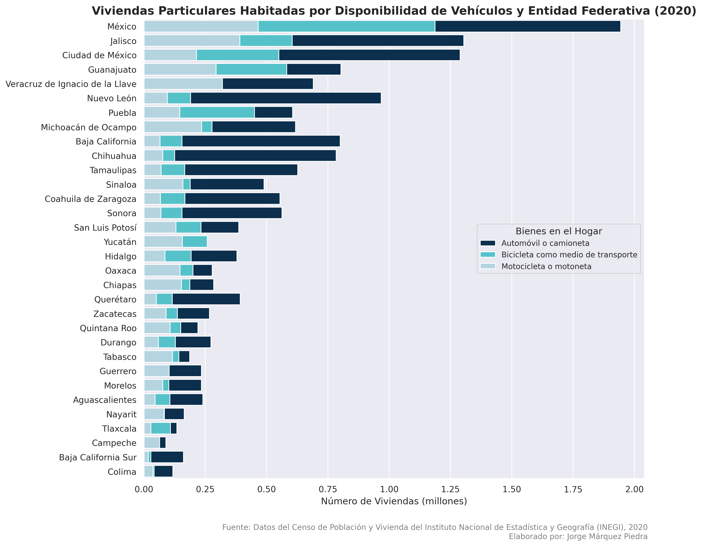

# Censo-Poblacion-y-Vivienda-INEGI-2020-Python

**Lenguaje: Python**

**Librerías: Pandas, Matplotlib, Seaborn, NumPy**

**Entornos: Google Colab / Jupyter Notebook**

## Este repositorio contiene un análisis integral desarrollado en Python para procesar, limpiar y diagnosticar los principales resultados por localidad (ITER) del Censo de Población y Vivienda 2020 de México (INEGI). 

## El proyecto automatiza la conversión de variables complejas del censo (ITER) para generar tanto pirámides poblacionales estructuradas como diversos gráficos de barras que evalúan casi la totalidad de los indicadores demográficos y de viviendas del país a nivel estatal y municipal.

****

****

****

****

****

****

****

****

****

****

****

****

****

****

## Los datos fueron obtenidos del [Censo de Población y Vivienda (CPV) 2020 del INEGI](https://www.inegi.org.mx/programas/ccpv/2020/#microdatos).
